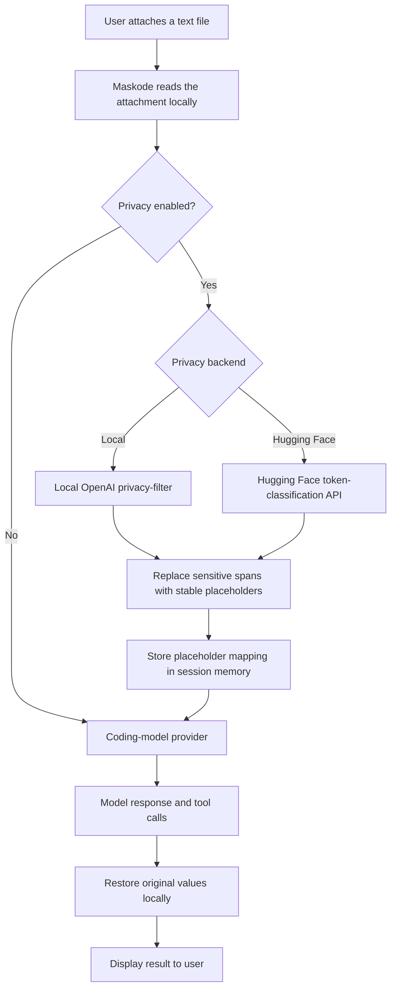

# Maskode

Maskode is a privacy-focused AI coding agent built as an unofficial fork of [OpenCode](https://github.com/anomalyco/opencode). It anonymizes sensitive information in attached text files before the files reach your coding-model provider, then restores the original values locally in responses and tool calls.

The privacy layer uses OpenAI's open-weight [`privacy-filter`](https://huggingface.co/openai/privacy-filter) model through either:

- Local inference, so file contents stay on your machine.
- Hugging Face Inference, for easier setup without running the classifier locally.

> Maskode is an independent project and is not affiliated with or endorsed by the OpenCode team, OpenAI, or Hugging Face.

## Get started

Choose how Maskode should run the privacy classifier:

| Mode | Best for | What leaves your computer? | Setup |
| --- | --- | --- | --- |
| **Local** | Maximum privacy | Only anonymized file text reaches the coding-model provider | Downloads approximately 3.4 GB |
| **Hugging Face** | Lightweight setup | Original attached text is sent to Hugging Face for classification | Requires `HF_TOKEN` |

### Option 1: local privacy (recommended)

The standard installer downloads Maskode and prepares the local privacy model:

```bash
curl -fsSL https://raw.githubusercontent.com/abdullahalsaidi16/maskode/dev/install.sh | sh
```

Then launch it:

```bash
maskode
```

### Option 2: Hugging Face privacy

Install Maskode without the large local model:

```bash
curl -fsSL https://raw.githubusercontent.com/abdullahalsaidi16/maskode/dev/install.sh | sh -s -- --without-privacy-model
```

Create an `opencode.json` from the included example and provide your token:

```bash
export HF_TOKEN=hf_your_token
cp opencode.example.json opencode.json
maskode
```

## How it works



For example:

```text
Original attachment:  Contact Alice at alice@example.com
Sent to provider:      Contact <MASKODE_PRIVACY_PRIVATE_PERSON_000001>
                      at <MASKODE_PRIVACY_PRIVATE_EMAIL_000001>
Displayed response:    Contact Alice at alice@example.com
```

Placeholder mappings are isolated per Maskode session, held only in memory, never sent to the coding-model provider, and discarded when Maskode exits.

Only attached text-file content is filtered. Ordinary chat messages, system prompts, binary/media attachments, and general tool output are currently outside the filter scope.

## Verify your setup

Check that the managed model is available:

```bash
maskode privacy status
```

Create a synthetic demonstration file and run one request:

```bash
printf 'Contact Alice Smith at alice@example.com.\n' > privacy-demo.txt
MASKODE_PRIVACY_LOG=/tmp/maskode-privacy.jsonl \
  maskode run --privacy "Summarize the attached contact." --file privacy-demo.txt
tail -1 /tmp/maskode-privacy.jsonl | jq .
```

The audit event's `providerText` should contain Maskode placeholders rather than the name and email.

## Privacy controls

Privacy filtering for attached text files is enabled by default. Open the privacy controls from the full terminal UI:

```text
/privacy
```

The dialog shows the current attachment-privacy status as `Enabled` or `Disabled`. Opening it does not change the setting. Use the dialog's displayed `enable` or `disable` action to change the setting, similar to managing servers with `/mcps`.

This control applies only to attached text files. It does not anonymize text typed directly into the chat.

Or override it for one run:

```bash
maskode --privacy
maskode --no-privacy
```

Set the persistent project default in `opencode.json`:

```json
{
  "privacy": {
    "enabled": true,
    "backend": "local",
    "scope": "attachments",
    "executable": "/absolute/path/to/opf-local"
  }
}
```

## Local privacy model

Local inference is the recommended mode when original file contents must not leave your machine.

For an existing Maskode installation, setup is one command:

```bash
maskode privacy install
maskode privacy status
```

Maskode stores the managed runtime under `~/.local/share/maskode/privacy` and discovers it automatically. Use `maskode privacy update` to refresh it or `maskode privacy uninstall` to remove it.

Build or install the companion `opf-local` executable, put it on `PATH`, and configure Maskode:

```json
{
  "privacy": {
    "enabled": true,
    "backend": "local",
    "executable": "/absolute/path/to/opf-local"
  }
}
```

You can override the executable for one run:

```bash
MASKODE_PRIVACY_FILTER=/absolute/path/to/opf-local maskode
```

The executable receives UTF-8 text over stdin and must support:

```bash
opf-local --format json --no-print-color-coded-text
```

See [the complete privacy setup](docs/MASKODE_PRIVACY.md) for its JSON output contract.

## Hugging Face inference

The Hugging Face backend sends original attached text to Hugging Face for privacy classification. Use local inference if that is not acceptable for your threat model.

Create a Hugging Face token with **Inference Providers** permission, export it, and copy the example configuration:

```bash
export HF_TOKEN=hf_your_token
cp opencode.example.json opencode.json
./maskode
```

The configuration references the environment variable, keeping the actual secret out of Git:

```json
{
  "privacy": {
    "enabled": true,
    "backend": "huggingface",
    "scope": "attachments",
    "api_key": "{env:HF_TOKEN}",
    "model": "openai/privacy-filter"
  }
}
```

Never commit an actual Hugging Face token.

## Audit anonymized requests

To inspect the anonymized file text sent to the coding model:

```bash
MASKODE_PRIVACY_LOG=/tmp/maskode-privacy.jsonl ./maskode
tail -f /tmp/maskode-privacy.jsonl | jq .
```

The audit log does not include API tokens or the placeholder mapping. It can still contain private information the classifier failed to detect, so handle it as sensitive data.

## Build from source

Requirements:

- [Bun](https://bun.sh/)
- Git
- A configured coding-model provider supported by OpenCode
- Optionally, a local `opf-local` executable or a Hugging Face token

```bash
git clone https://github.com/abdullahalsaidi16/maskode.git
cd maskode
bun install
cd packages/opencode
bun run script/build.ts --single --skip-install --skip-embed-web-ui
```

On Apple Silicon, run the development build with:

```bash
./dist/opencode-darwin-arm64/bin/maskode
```

During local development, you can also run:

```bash
cd packages/opencode
bun run --conditions=browser src/index.ts
```

## Configuration reference

| Setting | Default | Description |
| --- | --- | --- |
| `privacy.enabled` | `true` | Enables attachment filtering |
| `privacy.backend` | `local` | `local` or `huggingface` |
| `privacy.scope` | `attachments` | Current supported filtering scope |
| `privacy.executable` | `opf-local` | Local backend executable |
| `privacy.api_key` | `HF_TOKEN` | Hugging Face access token; prefer `{env:HF_TOKEN}` |
| `privacy.model` | `openai/privacy-filter` | Hugging Face model ID |
| `privacy.endpoint` | Hugging Face router | API-compatible inference endpoint |
| `privacy.log` | disabled | Optional JSONL audit-log path |

See [docs/MASKODE_PRIVACY.md](docs/MASKODE_PRIVACY.md) for detailed setup and behavior.

## Security limitations

PII detection is probabilistic. Maskode's privacy layer reduces accidental disclosure but does not guarantee that every secret or personal identifier will be detected. Evaluate the classifier using representative data before relying on it for sensitive medical, legal, financial, government, or production workloads.

The current mapping is memory-only. A response from an older session cannot be de-anonymized after Maskode restarts.

## Development

Run the focused privacy tests and package type checks:

```bash
cd packages/opencode
bun test test/session/privacy.test.ts
bun typecheck

cd ../tui
bun typecheck
```

Contributions and security reports are welcome. Please avoid including real credentials or personal information in issues, fixtures, and logs.

## Upstream and license

Maskode is based on [anomalyco/opencode](https://github.com/anomalyco/opencode). The fork keeps upstream Git history to preserve attribution and make future updates easier to merge.

The configuration filename remains `opencode.json` for compatibility with the upstream configuration ecosystem. Legacy `BOGU_PRIVACY_*` environment variables and existing managed-model installations are recognized as migration fallbacks.

Released under the [MIT License](LICENSE), matching the upstream project.
